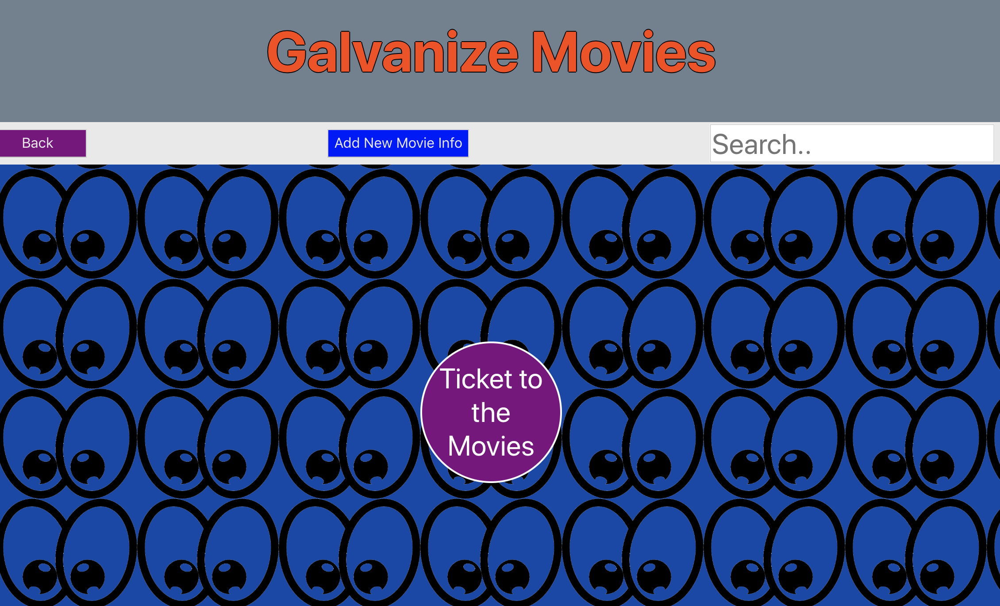

# Galvanize OMDb

This project was built to show mastery of both front and [back end](https://github.com/phengemuhle/movies-fullstack-back) building. A user can view, edit, add, or remove a movie. As well as adding or deleting a review of the listed movies. 

## Getting Started

Clone this repository and run `npm install`

## Deployment

Add additional notes about how to deploy this on a live system

## Built With

* [React](https://reactjs.org/docs/getting-started.html) - The web framework used
* [Router](https://github.com/ReactTraining/react-router/tree/master/packages/react-router/docs) - Library

## Authors

* **Phillip Hengemuhle** - *Initial work* - [Galvanize Movie Front-End](https://github.com/phengemuhle/movies-fullstack-front)
* **Phillip Hengemuhle** - *Initial work* - [Galvanize Movie Back-End](https://github.com/phengemuhle/movies-fullstack-back)

## Deployed Links
[Galvanize Movies](https://hengemuhle-movies.herokuapp.com/)
[Galvanize Movie DB](https://hengemuhle-movies-db.herokuapp.com/)